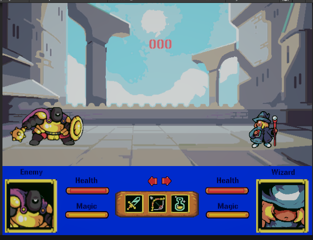
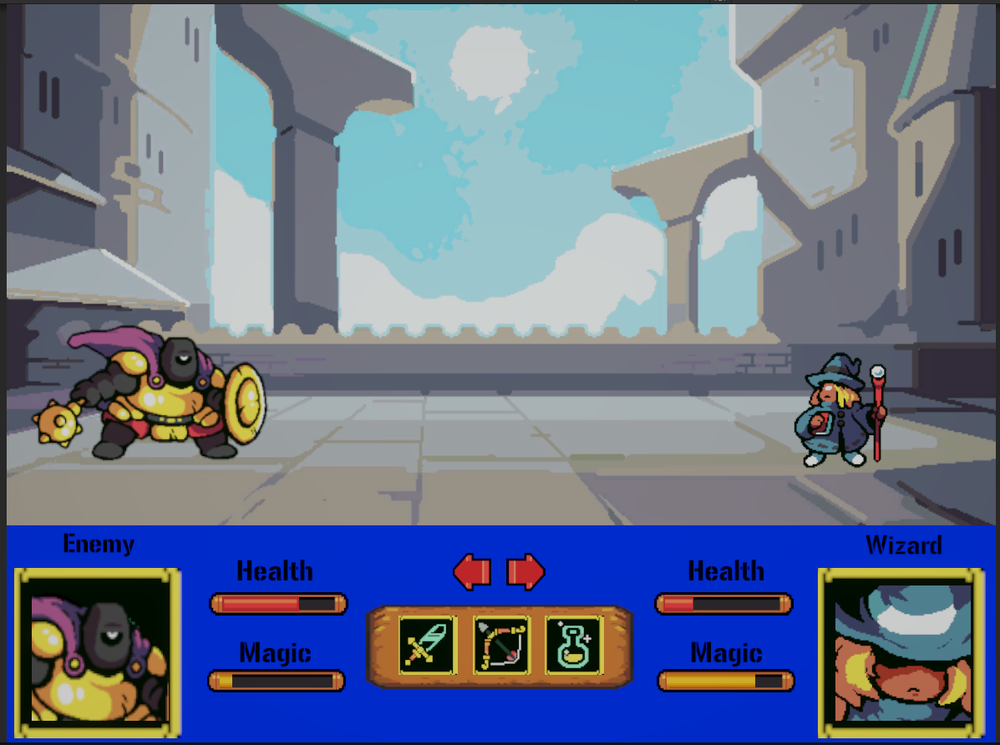

# 🎮 AI Project: Turn-Based Fighting Game  
# 📸 Project Screenshots  

Here are some snapshots of the project in action:  

---

## 🌟 Preview Gallery  

<table>
  <tr>
    <td align="center">
        
      <br/>✨ **Dashboard View**
    </td>
    <td align="center">
        
      <br/>⚡ **Analytics Page**
    </td>
  </tr>
  <tr>
    <td colspan="2" align="center">
        
      <br/>🌈 **Full Preview**
    </td>
  </tr>
</table>

---

<p align="center">
  
  
  
  
  
</p>

---

## 📖 Overview
This project is a **Turn-Based Fighting Game** powered by Unity and AI decision-making.  
The goal is to build a system where AI agents and players engage in tactical battles,  
demonstrating concepts of **state management, reinforcement learning, and turn-based mechanics**.  

---

✨ Features
Feature	Description
🎭 Turn-based combat	Player vs AI battles with tactical decision making
🤖 AI opponent	Reinforcement Learning algorithms decide AI moves
🛡️ Defensive mechanics	Guard, dodge, and counter-attack features
⚡ Special abilities	Unique skills unlocked during the battle
🎨 Customizable characters	Add your own characters with attributes
🚀 Installation & Setup
1️⃣ Extract Game Files

Download all split files (.part1.rar, .part2.rar, .part3.rar, …).

Place them in the same folder.

Right-click the first part (.part1.rar) → Select Extract Here.

WinRAR will automatically combine them into the full Unity project.

2️⃣ Open in Unity

Launch Unity Hub.

Click Add Project → Open.

Browse to the extracted folder (AI_Project_Turn-Based_Fighting_Game).

Select the project → Unity will fetch dependencies and load them.

3️⃣ Play & Enjoy 🎮

Once loaded, click ▶️ Play in Unity.

Explore player vs AI turn-based battles.

## 🧩 Game Flow (Mermaid Diagram)

🛠️ Tech Stack

🎮 Unity (latest stable version)

🐍 C# scripting

🧠 Reinforcement Learning for AI logic

🤝 Contributing

We ❤️ contributions!

Fork the repo 🍴

Create a new branch (feature/new-idea)

Commit your changes

Open a Pull Request

📜 License

This project is licensed under the MIT License – see LICENSE
 for details.

## 🎨 Decorative Flow  

```mermaid
flowchart LR
   A[📷 Screenshots] --> B(✨ Dashboard)
   A --> C(⚡ Analytics)
   A --> D(🌈 Full Preview)


